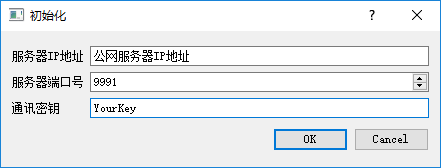

#NatTunnel是什么？可以用来干什么？
    NatTunnel·Server+Client是一套独立的公网辅助内网穿透软件。
    把NatTunnel·Server放置在一台公网服务器上，各个NatTunnel·Client可以互相建立p2p连接，连接成功后，可以添加Tcp端口转发。
####例1：
    公网服务器S，处于不同内网的机器A、B。
    A上运行着MySQL·Server(3306端口)，B想访问A上的MySQL。
    让A、B连接到服务端S，B向A建立连接，添加转发：3306->127.0.0.1:3306，B就可以直接访问本机3306端口来连接A的MySQL·Server。
####例2：
    公网服务器S，处于不同内网的机器A、B，另一台与A同一内网的机器C(内网地址192.168.1.101)。
    C上运行着MySQL·Server(3306端口)，B想访问C上的MySQL。
    让A、B连接到服务端S，B向A建立连接，添加转发：3306->192.168.1.101:3306，同上，B访问本机3306端口可以连接到C的MySQL·Server。
    
#使用方法
    如果你不想编译源代码，可以直接下载Release。解压dll*.7z，编辑NatTunnelServer.ini，格式如下：

    [Other]
    GlobalKey=YourKey       C/S传输密钥，必须相同
    
    [Port]                  Server需要1个Tcp端口用于维持长连接，2个Udp端口用于检测Client的NAT类型以及获取NAT外部端口号
    Tcp=9991
    Udp1=9992
    Udp2=9993
    
    [Binary]
    Windows=Client.exe      Server目录下也要放一个Client二进制文件，用于检测Client版本是否正确，目前只支持Windows
    
###运行Server
###运行Client，第一次运行会要求输入Server信息：
    
###填入Server端对应信息后，输入一个自己的用户名：
