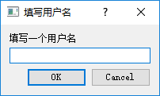
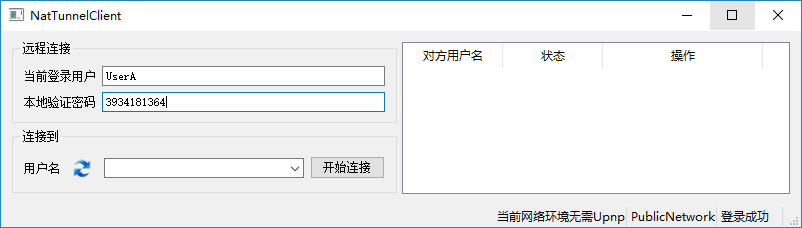

#NatTunnel是什么？可以用来干什么？
    NatTunnel·Server+Client是一套独立的公网辅助内网穿透软件。
    把NatTunnel·Server放置在一台公网服务器上，各个NatTunnel·Client可以互相建立p2p连接，连接成功后，可以添加Tcp端口转发。
    
#编译
    需要Qt4或5，至少需要vs2008环境。Linux下理论上也可以用，不过有些功能支持得不如Windows好。
    
#配置Server环境
    把编译出的Server.exe和Client.exe放在单独目录下，Qt相关dll也放在同一目录，需要哪些库下面有说明。
    创建一个文件，命名为NatTunnelServer.ini，输入以下内容：

    [Other]
    GlobalKey=YourKey       传输密钥，自行设置，所有连接到这个Server的Client都必须设置相同的密钥

    [Port]                  Server需要1个Tcp端口用于维持长连接，2个Udp端口用于功能支持
    Tcp=9991
    Udp1=9992
    Udp2=9993

    [Binary]
    Windows=Client.exe      把Client.exe放在目录下，这里填上文件名，用于版本检查，如果Client版本不对，Server会把正确的exe文件传过去，然后自动更新

#配置Client环境
    把Client.exe和Qt相关dll放在同一目录即可。
    
#依赖库
    Server：QtCore、QtNetwork、QtSql，还需要sqldrivers/qsqlite.dll。
    Client：QtCore、QtGui、QtWidgets(Qt5需要)、QtNetwork、QtXml。可能需要bearer/qgenericbearer4.dll和bearerqnativewifibearer4.dll，这两个不是很确定。
    
###运行Client，第一次运行会要求输入Server信息：

###填入Server端对应信息后，输入一个自己的用户名：

###登录成功后如图：

    左下角的下拉框会显示在线用户，点左边蓝色按钮刷新，选中一个用户，点击“开始连接”，输入对方本地密码，就可以连接了。
    连接成功后，右边表格会多出一行，点“管理转发”可以添加或查看Tcp转发，目前可以查看转入/转出，但是只能添加转出。

#关于登录验证
    首次登录会随机产生一个本地密码，被别人连接时需要验证本地密码，本地密码可以修改。
    Client首次运行生成的配置文件NatTunnelClient.ini中包含了随机标识符(RandomIdentifierSuffix)，也在第一次运行时随机产生。
    Client用随机标识符+网卡MAC地址作为机器ID，也就是说，如果更换网卡，或者删除配置文件，都会被认成另一台机器。
    如果有需要，同一个机器ID可以随意修改用户名，把配置文件的“UserName=”删掉，重新运行，就会让你重新输入，但是不能用别人已经占用还没弃用的用户名。
    所以，如果不小心变更了机器ID，那么原来的ID占用的用户名将不能重新使用，当然也可以用Sqlite编辑器手动修改Server目录下的User.db。
    
